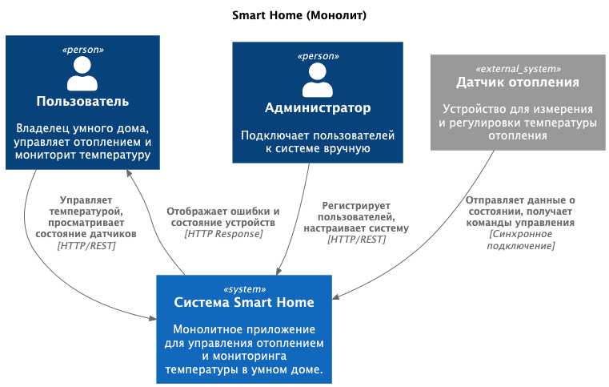
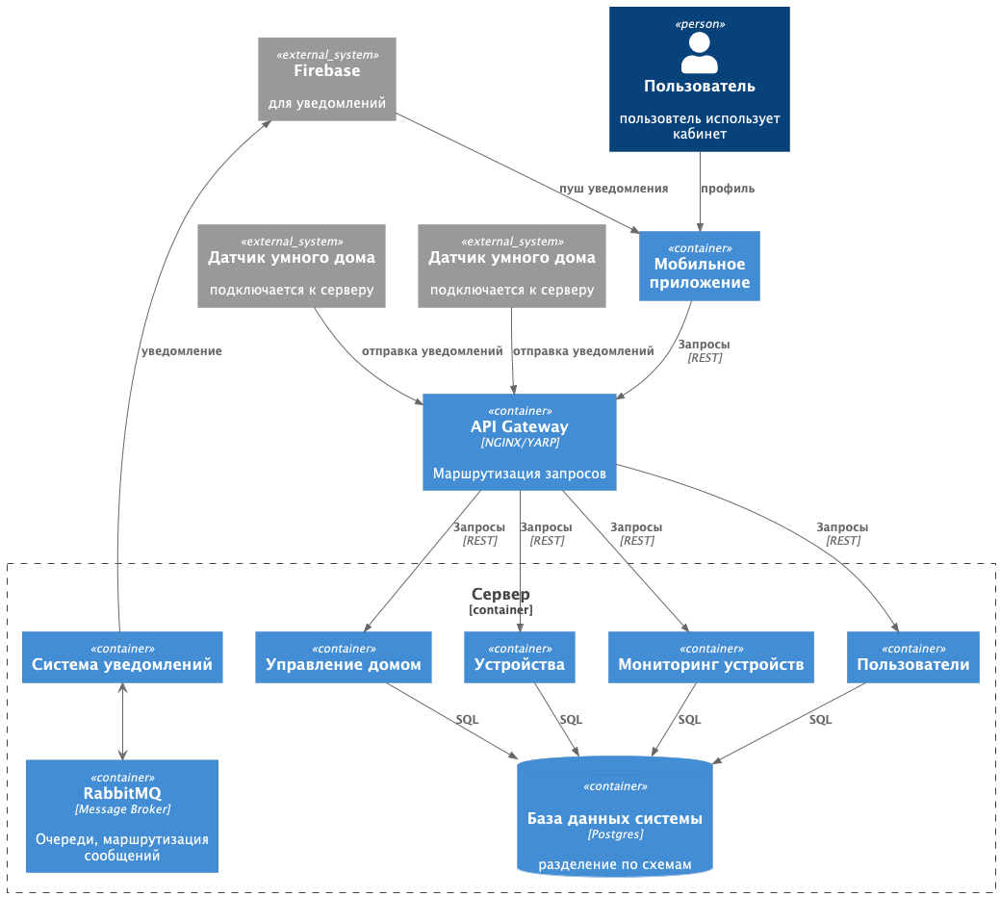
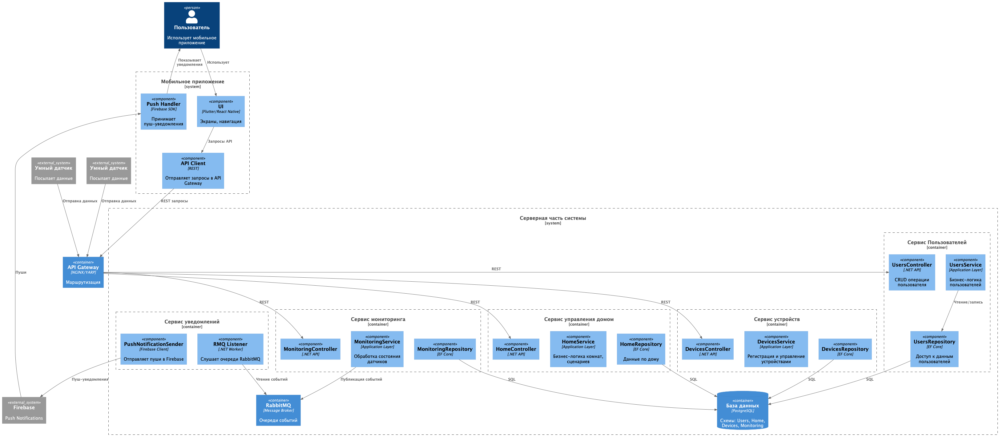
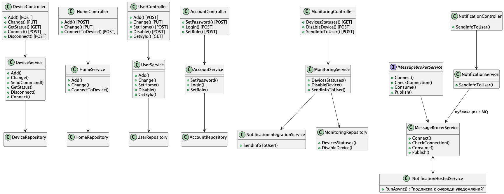
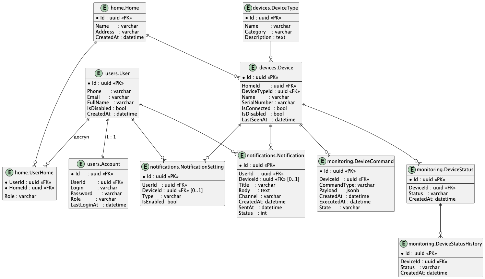

# Warmhouse


# Задание 1. Анализ и планирование

<aside>

Чтобы составить документ с описанием текущей архитектуры приложения, можно часть информации взять из описания компании и условия задания. Это нормально.

</aside

### 1. Описание функциональности монолитного приложения

**Управление отоплением:**

- Пользователи могут повышать или понижать температуру  
- Система поддерживает синхронные подключения напрямую с системой
- Пользователя можно подключить только вручную
- Система получает данные о температуре датчиков
    

**Мониторинг температуры:**

- пользователи могут следить за состоянием отопления
- при отключении устройства пользователи могут видеть что датчик прервал связь или есть ошибка

### 2. Анализ архитектуры монолитного приложения

- Язык программирования: Go
- База данных: PostgreSql
- Все запросы к сервису синхронны
- Не возможно масштабировать, так как требует пересмотра архитектуры
- Есть только датчики температуры

### 3. Определение доменов и границы контекстов

- Пользователи
    - Управление пользователями
    - Поддержка пользователей
- Управление домами
    - Привязка, отвязка к опеределенному дому
	
- Управление сенсорными устройствами
    - Добавление, удаление устройств
    - Регистрация сенсоров при включении
- Мониторинг системы
    - Изменение температуры отопления по каждому устройству
	- просмотр изменений статусов по домам и по типу сенсоров
    - Отображение неисправностей устройства
    - Оповещение системы при ошибке устройства

### **4. Проблемы монолитного решения**

1. Пользователи не могут подключаться самостоятельно
2. Система работает только для устройств отопления
3. Датчики отопления связываются напрямую к системе
4. Проблема масштабируемости системы, трудно масштабировать монолит
5. Проблема синхронности, пока один датчик не обработается, другой не сможет передать данные
6. Если есть балансировщик, при падении системы не будет работать часть датчиков или надо их переподключать
7. Вся логика решения находиться в рамках одного приложения

### 5. Визуализация контекста системы — диаграмма С4



# Задание 2. Проектирование микросервисной архитектуры

**Диаграмма контейнеров (Containers)**



**Диаграмма компонентов (Components)**



**Диаграмма кода (Code)**



# Задание 3. Разработка ER-диаграммы



# Задание 4. Создание и документирование API

### 1. Тип API

Укажите, какой тип API вы будете использовать для взаимодействия микросервисов. Объясните своё решение.

### 2. Документация API

Здесь приложите ссылки на документацию API для микросервисов, которые вы спроектировали в первой части проектной работы. Для документирования используйте Swagger/OpenAPI или AsyncAPI.

# Задание 5. Работа с docker и docker-compose

Перейдите в apps.

Там находится приложение-монолит для работы с датчиками температуры. В README.md описано как запустить решение.

Вам нужно:

1) сделать простое приложение temperature-api на любом удобном для вас языке программирования, которое при запросе /temperature?location= будет отдавать рандомное значение температуры.

Locations - название комнаты, sensorId - идентификатор названия комнаты

```
	// If no location is provided, use a default based on sensor ID
	if location == "" {
		switch sensorID {
		case "1":
			location = "Living Room"
		case "2":
			location = "Bedroom"
		case "3":
			location = "Kitchen"
		default:
			location = "Unknown"
		}
	}

	// If no sensor ID is provided, generate one based on location
	if sensorID == "" {
		switch location {
		case "Living Room":
			sensorID = "1"
		case "Bedroom":
			sensorID = "2"
		case "Kitchen":
			sensorID = "3"
		default:
			sensorID = "0"
		}
	}
```

2) Приложение следует упаковать в Docker и добавить в docker-compose. Порт по умолчанию должен быть 8081

3) Кроме того для smart_home приложения требуется база данных - добавьте в docker-compose файл настройки для запуска postgres с указанием скрипта инициализации ./smart_home/init.sql

Для проверки можно использовать Postman коллекцию smarthome-api.postman_collection.json и вызвать:

- Create Sensor
- Get All Sensors

Должно при каждом вызове отображаться разное значение температуры

Ревьюер будет проверять точно так же.


# **Задание 6. Разработка MVP**

Необходимо создать новые микросервисы и обеспечить их интеграции с существующим монолитом для плавного перехода к микросервисной архитектуре. 

### **Что нужно сделать**

1. Создайте новые микросервисы для управления телеметрией и устройствами (с простейшей логикой), которые будут интегрированы с существующим монолитным приложением. Каждый микросервис на своем ООП языке.
2. Обеспечьте взаимодействие между микросервисами и монолитом (при желании с помощью брокера сообщений), чтобы постепенно перенести функциональность из монолита в микросервисы. 

В результате у вас должны быть созданы Dockerfiles и docker-compose для запуска микросервисов. 